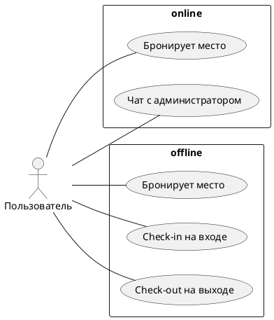
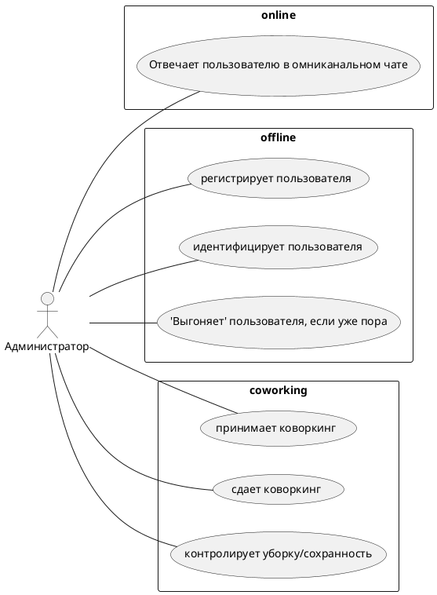
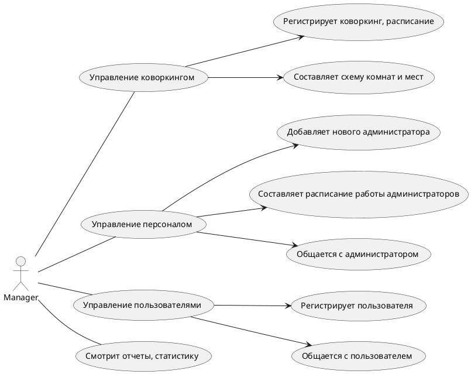
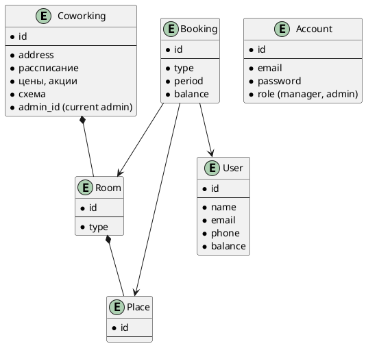

# coworking-design

Architectural design of a coworking network management system.

2025-05-20

<!-- TOC -->

1. [Глоссарий](#глоссарий)
2. [Use cases](#use-cases)
3. [Бизнес объекты](#бизнес-объекты)

<!-- /TOC -->

## Глоссарий

- *Менеджер* управляет коворкингами, их администраторами и пользователями (online)
- *Администратор* коворкинга offline, на связи online
- *Пользователь* имеет аккаунт, offline, online (web site, mobile app)

- Коворкинг
- Схема комнат и рабочих мест в коворкинге
- Комната в коворкинге
  - Типы комнат: working, переговорка, common
- Место в комнате (стол, с компьютером, с канц. товарами)
- Расписание работы коворкинга для пользователей
  - C 7:00 до 10:00
  - Круглосуточно
  - Только по рабочим дням
  - Каждый день
- Цены коворкинга
- Скидки, акции
- Features коворкинга
  - Бытовые аксессуары коворкинга
  - Микроволновка, Чайник, 
  - Доставка еды через сторонние системы
  - Столовая
  - Принтер

- Расписание работы администраторов
- Смена администратора
  - как происходит пересменка?

- Бронь пользователя на место в коворкинге
  - фиксированное место или на-свободное
  - срок, по часам, по дням, по месяцам
- Бронь пользователя на комнату

## Use cases

## Бизнес объекты

